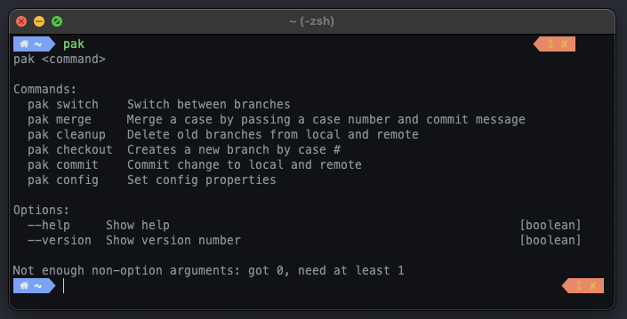

# Pak CLI

Pak CLI wraps Bug & VCS APIs into a set utilities designed to make your day of developing a little better!  A deliberately opinionated workflow.  If you need to rebase or cherry pick from branches for merging to master, you'll need to resort to the using those GIT commands directly. 



## Getting Started

1. Install and build project by following the steps [here](../../readme.md). 
2. Set required configuration entries by running ```pak config``` in the terminal.

## Available Commands

* [help](#help)
* [switch](#switch)
* [merge](#merge)
* [cleanup](#cleanup)
* [checkout](#checkout)
* [commit](#commit)
* [config](#config)


### Help 

To list all available commands.  See screen shot above.

```sh
pak
```

or

```sh
pak --help
```

### switch
This command will prompt you with list available branches that you can switch to (master, release branches & existing branches).  It will switch the repo to the selected branch.

#### Example
```sh
pak switch
```

### merge
This command will prompt you with list available branches where the case is in step 6. (ok to merge).  It will merged code from case's related branch to master and walk you through prompts to assign case to Buildmaster and set step to 7.

#### Example
```sh
pak merge
```

### cleanup

This command will prompt you with list available branches that can be deleted.  It will delete the local and remote branch of the selected.

#### Example
```sh
pak cleanup
```

### checkout
This command will prompt you with list available cases in Fogbugz that don't have branches yet.  It will create a local and remote branch from your selection and update case's step to 3 (Coding in Progress).

#### Example
```sh
pak checkout
```

### commit
This command will walk you through prompts to add unstaged changes, add a message, and options to move to case into code review by assigning to a selected team and setting the case's step to 5(Ready for Review).

#### Example
```sh
pak commit
```

### config
Set config properties.


#### Usage

```
Options:
      --version     Show version number                                                    [boolean]
  -h, --help        Show help                                                              [boolean]
  -u, --username  The username used in GIT branch names.  ex: users/{username}/fb-12345    [string]
  -b, --branch    Default branch name. Common are "master" or "main"                       [string]
  -t, --token     The FogBugz API access token                                             [string]
  -o, --origin    The origin part of your FogBugz site.  Ex:  http://www.fogbugz.com       [string]
  -f, --filter    The FogBugz filter you want to get case results for                      [string]
```

#### Example
to be prompted for all config properties

```sh
pak config 
```

or with optional parameters 

```sh
pak config -u myusername
```