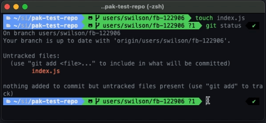

# Pak CLI

A CLI that helps to simplify and speed up a developer's workflow.  It removes many repetitive steps dealing with case management and version control.  If you've ever opened FogBugz to find the case number to create a branch or to tell one branch from another, you will like this CLI.  Commands like [commit](#commit) and [merge](#merge) walk you through prompts that help update cases from within the command line. 

*If your workflow has you reaching for rebase or cherry pick for merging to master, you'll need to resort to the using those GIT commands directly. 


## Getting Started

1. Install and build project by following the steps [here](../../readme.md). 
2. Set required configuration entries by running the [config](#config) command.

## Available Commands

* [help](#help)
* [checkout](#checkout)
* [commit](#commit)
* [merge](#merge)
* [switch](#switch)
* [cleanup](#cleanup)
* [config](#config)


### Help 

To list all available commands.  See screen shot above.

```sh
pak
```

or

```sh
pak --help
```

### checkout
This command will prompt you with list available cases in Fogbugz that don't have branches yet.  It will create a local and remote branch from your selection and update case's step to 3 (Coding in Progress).

#### Prompts 
| Prompt     | Type   | Description                                                           |
|--------------|--------|-----------------------------------------------------------------------|
| Select branch      | select |  (required) Displays a list of cases |


#### Example
```sh
pak checkout
```

### commit
This command will walk you through prompts for adding unstaged changes, a commit message, and other options that move a case into code review by assigning the case to a selected team and setting the case's step to 5(Ready for Review).

#### Prompts 
| Prompt     | Type   | Description                                                           |
|--------------|--------|-----------------------------------------------------------------------|
| Added unstaged changes     | yes (default) / no |  (required) |
| Commit message     | input |  (required) message for commit |
| Send to code review     | yes / no (default)|  (optional) |
| Assign to     | select |  (require for code review) Display list of teams to assign to |
| QA testable    | yes (default) / no |  (require for code review) |
| Where is change    | input |  (require for code review) Describe change for QA |
| Where was change    | input |  (require for code review) Part of site or URL |
| Any notable risks or notes   | yes / no (default) |  (require for code review) |
| Case notes    | input |  (require for code review) Note for code reviewer |



#### Example
```sh
pak commit
```

### merge
This command will prompt you with list of available branches where the case is in step 6. (ok to merge).  It will merge code from case's branch to master and walk you through prompts to assign case to Buildmaster and set step to 7.

#### Prompts 
| Prompt     | Type   | Description                                                           |
|--------------|--------|-----------------------------------------------------------------------|
| Select case      | select |  (required) Displays a list of cases ready to merge |
| Select or enter commit message      | select |  (required) Asks you to enter a new message or select a previously commited message |
| Send to Buildmaster     | yes (default) / no |  (optional) - Do you want to update FogBugz and send to BM? |
| Merge to release     | yes / no (default) |  (optional) - Do you need to merge to a release tag? |
| Select release     | select |  (required for merge to release) - Displays a list of release dates |
| Select commit to release     | select |  (required for merge to release) - Displays a list of related commits for case  |


#### Example
```sh
pak merge
```

### switch
This command will prompt you with list available branches that you can switch to (master, release branches & existing branches).  It will switch the repo to the selected branch.

#### Prompts 
| Prompt     | Type   | Description                                                           |
|--------------|--------|-----------------------------------------------------------------------|
| Select branch      | select |  (required) Displays a list of branches |


#### Example
```sh
pak switch
```


### cleanup

This command will prompt you with list available branches that can be deleted.  It will delete the local and remote branch of the selected.

#### Example
```sh
pak cleanup
```

#### Prompts 
| Prompt     | Type   | Description                                                           |
|--------------|--------|-----------------------------------------------------------------------|
| Select branch      | select |  (required) Displays a list of branches |


### config
Set config properties.


#### Usage

```
Options:
      --version     Show version number                                                    [boolean]
  -h, --help        Show help                                                              [boolean]
  -u, --username  The username used in GIT branch names.  ex: users/{username}/fb-12345    [string]
  -b, --branch    Default branch name. Common are "master" or "main"                       [string]
  -t, --token     The FogBugz API access token                                             [string]
  -o, --origin    The origin part of your FogBugz site.  Ex:  http://www.fogbugz.com       [string]
  -f, --filter    The FogBugz filter you want to get case results for                      [string]
```

#### Example
to be prompted for all config properties


#### Prompts 
| Prompt     | Type   | Description                                                           |
|--------------|--------|-----------------------------------------------------------------------|
| Username     | input |  (required) the name used in branch construction ex: /users/{name}/fb-1234 |
| Access Token     | input |  (required) an API token from FogBugz.  |
| Origin URL     | input |  (required) the origin URL of FogBugz.  http://www.example.com |
| Filter     | select |  (required) Select a saved filter from FogBugz for this CLI to monitor for new cases |


```sh
pak config 
```

or with optional parameters 

```sh
pak config -u myusername
```